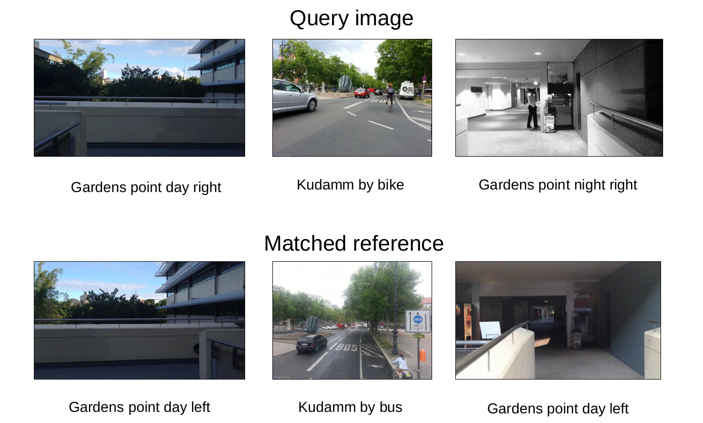

# Netvlad-Keras
This is a Keras implementation of the [NetVLAD](https://www.di.ens.fr/willow/research/netvlad/) architecture for visual place recognition. The main purpose of this project is to provide an easy to use (and trainable) Keras model.

The original Netvlad model was written in matlab ([Github page](https://github.com/Relja/netvlad)) and later transfered to Tensorflow ([Github page](https://github.com/uzh-rpg/netvlad_tf_open)).

## Overview
The model can be found in `netvlad_keras.py` along with the custom layer in `netvladlayer.py`. The latter is adapted from the tensorflow version. The file `savemodel.py` sets the weights from the tensorflow checkpoint to the keras model and stores them. Since the main work was to get these weights from matlab to tensorflow, I encourage everyone using this repository to also cite the author's paper:

>T. Cieslewski, S. Choudhary, D. Scaramuzza: Data-Efficient Decentralized Visual SLAM IEEE International Conference on Robotics and Automation (ICRA), 2018.

In addition, `compare.py` checks wheather the outputs of the two models are consistent between Tensorflow and Keras for a given dataset.
`check_layers.py` is a low level debugging script which allows you to compare the two model's outputs for each layer.

## How to use

1. Download the weights from [here](https://1drv.ms/u/s!AuunpfP7kocxkeElzct-xFlMnVM4cg?e=uOVgF4) or create them on your own using `savemodel.py`.

2. Create the model and load the weights
    ```
    from netvlad_keras import NetVLADModel
    model = NetVLADModel()
    model.load_weights('netvlad_weights.h5')
    model.build()
    ```
3. Get the output for a batch of images
    ```
    output = model.predict(batch)
    ```

A working example can be found in `example.py`

## Some results
A few results showing the best match in a dataset given the query image


## TODO
* Currently, the model cannot be loaded from a file because of the custom layers.
* The loss function has to be implemented (the model is not trainable yet)


